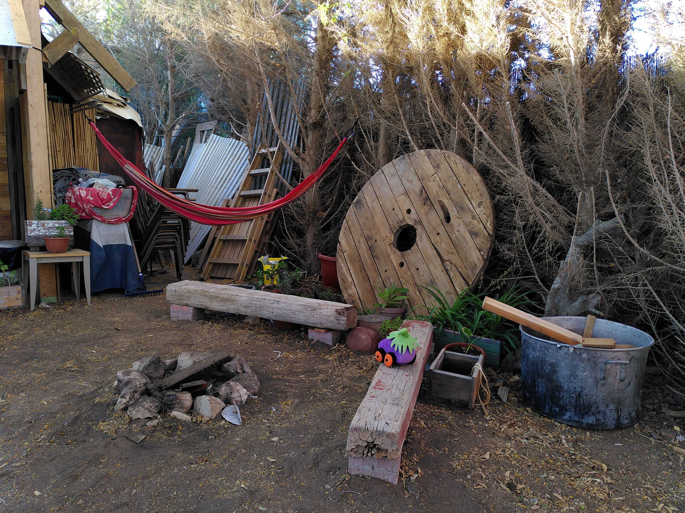

-----------------------------------------------

This group is a space for recurring updates & discussions around the emerging Clojure stack for data processing, analysis, and visualization.

## Future meetings

* 2025-01-31 - meeting 7: Data-recur meeting 7 - R4Clj 1: Introducing R and the Tidyverse :calendar: [event](https://clojureverse.org/t/data-recur-meeting-7-r4clj-1-introducing-r-and-the-tidyverse/)

## Past meetings

* 2024-08-08 - meeting 6: Clojure Meets Metal: Working with native libraries and the GPU - :movie_camera: [summary & recording](https://clojureverse.org/t/data-recur-meeting-6-clojure-meets-metal-working-with-native-libraries-and-the-gpu-summary-recording/)
* 2024-06-29 - meeting 5: Datajure - :movie_camera: [summary & recording](https://clojureverse.org/t/data-recur-meeting-5-datajure-summary-recording/)
* 2022-11-05 - meeting 4: Tablecloth - :movie_camera: [summary & recording](https://clojureverse.org/t/data-recur-meeting-3-meander-summary-video/)
* 2022-09-30 - meeting 3: Meander - :movie_camera: [sumamry & video](https://clojureverse.org/t/data-recur-meeting-4-tablecloth-summary-video/)
* 2022-08-27 - meeting 2: Clojask, columns for Tablecloth, ds4clj, and more - :movie_camera: [summary & recording](https://clojureverse.org/t/data-recur-meeting-2-clojask-columns-for-tablecloth-summary-video/)
* 2022-07-29 - meeting 1: clojure.walk, community updates - :movie_camera: [summary & recording](https://clojureverse.org/t/data-recur-meeting-1-clojure-walk-community-updates-summary-video/)

## Future topics
- Machine learning: Tablecloth, scicloj.ml, Metamorph
- Interop with a Python array library, e.g. Tensorflow, JAX, Xarray 
- Going deeper into Meander
- General data science workflow with relevant tools and libraries

## More info

**Organizers**: Ethan Miller & Daniel Slutsky (please reach out at the [Clojurians Zulip](https://clojurians.zulipchat.com/))

**Frequency of meetings**: All-hands monthly meetings + ad-hoc meetings on specific topics

**Chat stream**: [#data-recur](https://clojurians.zulipchat.com/#narrow/stream/330726-data-recur)

