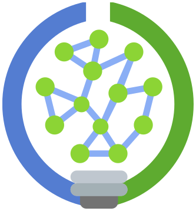

[📅Follow our meetings on the Clojure Calendar Feed📅](/docs/community/events/)

# macroexpand gatherings

Growing Clojure together

## TL;DR
We're running regular online meetups to help Clojure reach new domains and use cases. 

## Meetings

* October 2025: [Macroexpand-2025](https://scicloj.github.io/macroexpand-2025/) conferences

* Coming soon: macroexpand-3 - a gathering where representatives of Clojure communities (local and online) will share their experiences and future hopes, and initiate some work on common resources

* Aug 9th 2025: macroexpand-2 - connecting Clojure data practitioners, startups, consultancies, and academics - :calendar: [event](https://clojureverse.org/t/macroexpand-2-connecting-clojure-data-practitioners/)

* May 17th 2025 - [macroexpand-1](https://scicloj.github.io/scinoj-light-1/sessions.html#macroexpand-1) (:movie_camera: [video]( https://www.youtube.com/watch?v=2TY6cJ8YiwU)) - part of the [SciNoj Light #1](https://scicloj.github.io/scinoj-light-1/) conference

## Background

For the past few years, Scicloj has focused inward - building tools and libraries while growing our community through our [mentoring program](https://scicloj.github.io/docs/community/groups/open-source-mentoring/) and other small group meetings.

Now in 2025, we are also looking outward as well, seeking to bring Clojure to new fields and users. We have been busy creating [beginner-friendly tools](https://www.youtube.com/watch?v=tDz1x2d65C0), running [workshops](https://bobkonf.de/2025/howe.html), organizing [meetings](https://scicloj.github.io/docs/community/events/) at the various [study groups](https://scicloj.github.io/docs/community/groups/), writing [tutorials](https://scicloj.github.io/clojure-data-tutorials/), building a [starter toolkit](https://scicloj.github.io/noj/), and launching [a conference](https://scicloj.github.io/docs/community/groups/scinoj-light/) for new data use cases.

While Scicloj focuses mostly on data science, we believe that growing Clojure as a whole helps everyone. Getting there will require looking and reflecting both inward and outward, and forming new collaborations around new ideas.

That's why we're running *macroexpand* - regular gatherings where Clojurians can work together on bringing Clojure to new places.

## Format

Each macroexpand gathering focuses on one area where we'd like to see more Clojure adoption - like education, research, academia, or art. Note these areas naturally overlap.

Meetings run between 90 minutes to a few hours, mixing short talks with open discussion. We record key parts and create clear next steps for follow-up.

We're keeping things simple and informal to make it easy to join in, share ideas, and find others to work with.

## Getting Involved

We'd love to hear your ideas and feedback. Get in touch:

<a class="btn btn-primary btn-lg px-4 mb-2" href="/docs/community/contact/" role="button">Contact Us</a>

