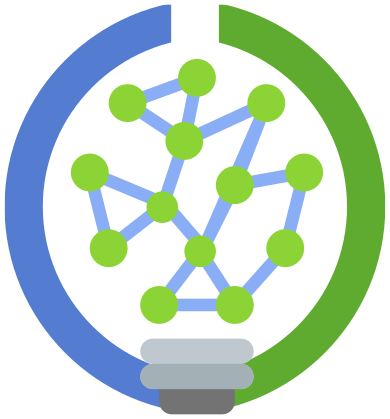

```{=html}
<style>
  /* The hero below is this page's title; suppress Quarto's own title block. */
  #title-block-header { display: none; }
</style>

<div class="home-hero">
  
  <div class="home-hero__title">Scicloj</div>
  <p class="home-hero__subtitle">Helping Clojure grow in new fields</p>
  <p><a class="btn btn-gradient btn-lg" href="/docs/community/getting_involved/" role="button">Get involved</a></p>
  <div class="home-hero__news">
    <p><a href="/docs/community/events/">📅 Follow our events at the Clojure Events Calendar feed</a></p>
  </div>
</div>

<div class="home-cards">
  <div class="home-card">
    <h3><a href="/noj/">A data science stack</a></h3>
    <p>Scicloj is building a set of tools and libraries for data-science and scientific computing in Clojure.</p>
  </div>
  <div class="home-card">
    <h3><a href="/docs/resources/">Learning resources</a></h3>
    <p>Scicloj is running study groups and workshops and creating learning resources — for Clojurians interested in data science, and for data scientists interested in Clojure.</p>
  </div>
  <div class="home-card">
    <h3><a href="/docs/community/groups/">Dev groups</a></h3>
    <p>Scicloj is a platform for open-source dev groups to meet, collaborate, and create their joint knowledge.</p>
  </div>
  <div class="home-card">
    <h3><a href="/docs/community/getting_involved/">Open-source mentoring</a></h3>
    <p>Scicloj is encouraging newcomers to join open-source projects and helping them throughout their journey.</p>
  </div>
</div>
```
